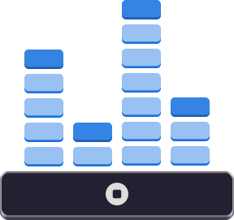

<h1 align="center">
    
     
    Pulse
</h1>

    <strong>A simple music visualizer video creator</strong>

<!-- TODO: Add a screenshot of the application -->

*Pulse* is a software designed to create music visualizer videos from audio tracks. Pulse is written in Python and GTK and uses [MusicVisualizerVideoMaker](https://github.com/IvanLazic2/MusicVisualizerVideoMaker) by [IvanLazic2](https://github.com/IvanLazic2) to create videos.

## Documentation

You can find detailed documentation in the [docs](docs) directory. This includes:

- **Installation Guide**: Instructions on how to install and set up Pulse.
- **User Guide**: A comprehensive guide on how to use Pulse.

## Contributing

Please see the [contributing guidelines](docs/CONTRIBUTING.md) for more information.

## License

Pulse is licensed under the MIT License. See the [LICENSE](LICENSE) file for more details.